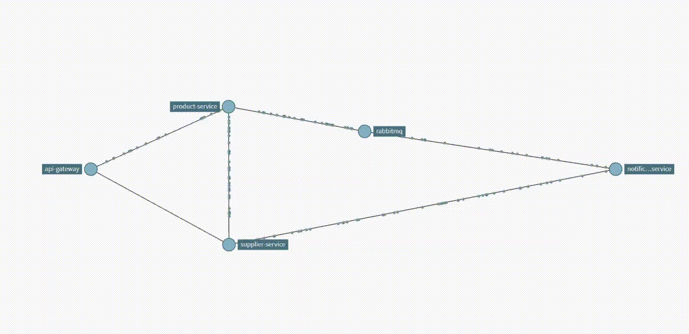

<div id="top"></div>

<div align="center">
<h3 align="center">BMWoods Microservice</h3>
  <p align="center">
    An example of spring microservice
  </p>
</div>


<!-- TABLE OF CONTENTS -->
<details>
  <summary>Table of Contents</summary>
  <ol>
    <li>
      <a href="#about-bmwoods-microservice">About BMWoods Microservice</a>
      <ul>
        <li><a href="#built-with">Built With</a></li>
      </ul>
    </li>
    <li>
      <a href="#getting-started">Getting Started</a>
      <ul>
        <li><a href="#prerequisites">Prerequisites</a></li>
        <li><a href="#installation">Installation</a></li>
      </ul>
    </li>
    <li><a href="#license">License</a></li>
    <li><a href="#contact">Contact</a></li>
    <li><a href="#acknowledgments">Acknowledgments</a></li>
  </ol>
</details>


<!-- ABOUT BMWoods Microservice -->
## About BMWoods Microservice

<div align="center">
    
</div>

BMWoods Microservice provides an Inventory Management Solution that helps BMWoods keep track of items stock, price, 
and notify supplier when new items has been registered into BMWoods via Google Mail SMTP. This project aims to build 
backend services and embrace microservice architecture as its standard.

<p align="right">(<a href="#top">back to top</a>)</p>


### Built With

The major frameworks/libraries that powered this project.

* [Spring Boot](https://spring.io/projects/spring-boot)
* [Spring Cloud](https://spring.io/projects/spring-cloud)
* [Spring Data JPA](https://spring.io/projects/spring-data-jpa)
* [Spring AMQP](https://spring.io/projects/spring-amqp)
* [RabbitMQ](https://www.rabbitmq.com/)
* [Zipkin](https://zipkin.io/)

<p align="right">(<a href="#top">back to top</a>)</p>


<!-- GETTING STARTED -->
## Getting Started

In case you want to run locally on your machine, follow the steps below.


### Prerequisites

Mandatory requirements before proceeding to installation.

- JDK 17
- Git
- Docker

### Installation

1. Clone the repository
   ```sh
   git clone https://github.com/bondopangaji/bmwoods-microservice.git
   ```
   
2. With terminal, change your current directory to the project base directory


3. Run docker compose
   ```sh
   docker compose up -d
   ```
4. Open PgAdmin4, Login, and create respective database for each service
   ```sh
    http://localhost:5050/browser/
   ```
   
5. In notification-service hover to resources, edit username and password in the application.yml
   ```
   username: <your-google-smtp-email>
   password: <your-google-app-password>
   ```
   
   
6. Now you can run the discovery server, api gateway and services


7. Resource links (prerequisite: installed locally)

   * Discovery Server
       ```
       http://localhost:8761/
       ```
   * Postgres Management Tool
       ```
       http://localhost:5050/browser/
       ```
   * Distributed Tracing Tool
       ```
       http://localhost:9411/zipkin/
       ```
   * Message Queue Management Tool
       ```
       http://localhost:15672/
       ```


<p align="right">(<a href="#top">back to top</a>)</p>


## Usage

Usage example

1. Example
   
   - Register Supplier
        <div>
           
        </div>
   - Persisted Supplier in DB
        <div>
           
        </div>     
   - Register Product
        <div>
           
        </div>    
   - Persisted Product in DB
        <div>
           
        </div>
   - Gmail Notification
        <div>
           
        </div>
   - Persisted Notification in DB
        <div>
           
        </div>    
    
    
2. Discovery Server
   <div>
        
   </div>
   

3. Zipkin Distributed Tracing
   <div>
        
   </div>


<!-- LICENSE -->

## License

Distributed under the MIT License. See `LICENSE` for more information.

<p align="right">(<a href="#top">back to top</a>)</p>


<!-- CONTACT -->

## Contact

Bondo Pangaji - [bondopangaji@gmail.com](mailto:bondopangaji@gmail.com)

Project Link: [https://github.com/bondopangaji/bmwoods-microservice](https://github.com/bondopangaji/bmwoods-microservice)

<p align="right">(<a href="#top">back to top</a>)</p>


<!-- ACKNOWLEDGMENTS -->

## Acknowledgments

Helpful resources.

- [Official Framework/Library Documentation]()
- [Tom Hombergs's Books](https://www.packtpub.com/authors/tom-hombergs)
- [Baeldung](https://www.baeldung.com/)
- [Amigoscode](amigoscode.com)

<p align="right">(<a href="#top">back to top</a>)</p>


<!-- REFERENCE -->
<!-- https://www.markdownguide.org/basic-syntax/#reference-style-links -->