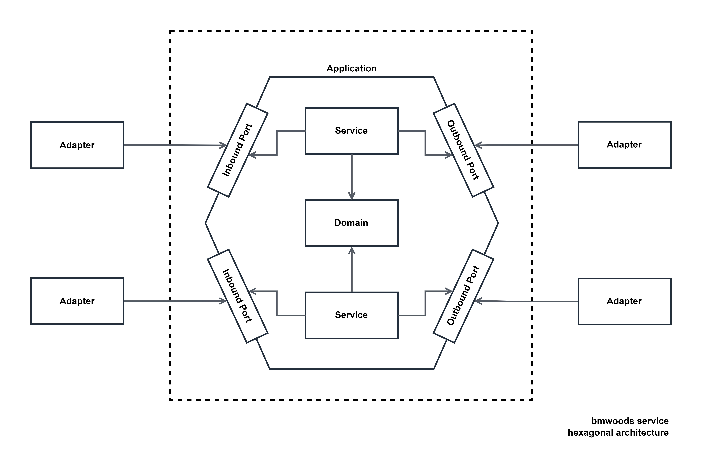

<div id="top"></div>

<div align="center">
<h3 align="center">Notification Service</h3>
  <p align="center">
    Notification Service of BMWoods Microservice
  </p>
</div>


<!-- TABLE OF CONTENTS -->
<details>
  <summary>Table of Contents</summary>
  <ol>
    <li>
      <a href="#about-the-project">About The Project</a>
      <ul>
        <li><a href="#built-with">Built With</a></li>
      </ul>
    </li>
    <li><a href="#license">License</a></li>
    <li><a href="#contact">Contact</a></li>
    <li><a href="#acknowledgments">Acknowledgments</a></li>
  </ol>
</details>


<!-- ABOUT THE PROJECT -->
## About Product Service

<div align="center">
    
</div>

Notification Service process notification-related business application with PostgreSQL as its database. Hexagonal Architecture and
SOLID principle was implemented during the development of the service, this implementation will invert code dependencies
so that the domain code has no dependencies to the outside, that leaves the domain decoupled from persistence and UI layer.
This strategy will reduce reason to change code base resulting higher maintainability.

<p align="right">(<a href="#top">back to top</a>)</p>


### Built With

The major frameworks/libraries that powered this project.

* [Spring Boot](https://spring.io/projects/spring-boot)
* [Spring Cloud](https://spring.io/projects/spring-cloud)
* [Spring Data JPA](https://spring.io/projects/spring-data-jpa)
* [Spring AMQP](https://spring.io/projects/spring-amqp)
* [RabbitMQ](https://www.rabbitmq.com/)
* [Zipkin](https://zipkin.io/)

<p align="right">(<a href="#top">back to top</a>)</p>


<!-- USAGE EXAMPLES -->
## Usage

Resource links (prerequisite: installed locally)

* Discovery Server
    ```
    http://localhost:8761/
    ```
* Postgres Management Tool
    ```
    http://localhost:5050/browser/
    ```
* Distributed Tracing Tool
    ```
    http://localhost:9411/zipkin/
    ```
* Message Queue Management Tool
    ```
    http://localhost:15672/
    ```

<!-- LICENSE -->

## License

Distributed under the MIT License. See `LICENSE` for more information.

<p align="right">(<a href="#top">back to top</a>)</p>


<!-- CONTACT -->

## Contact

Bondo Pangaji - [bondopangaji@gmail.com](mailto:bondopangaji@gmail.com)

Project Link: [https://github.com/bondopangaji/bmwoods-microservice](https://github.com/bondopangaji/bmwoods-microservice)

<p align="right">(<a href="#top">back to top</a>)</p>


<!-- ACKNOWLEDGMENTS -->

## Acknowledgments

Helpful resources.

- [Official Framework/Library Documentation]()
- [Tom Hombergs's Books](https://www.packtpub.com/authors/tom-hombergs)
- [Baeldung](https://www.baeldung.com/)
- [Amigoscode](amigoscode.com)

<p align="right">(<a href="#top">back to top</a>)</p>


<!-- REFERENCE -->
<!-- https://www.markdownguide.org/basic-syntax/#reference-style-links -->